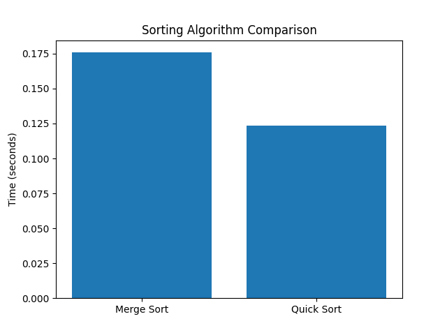

# COP3530 Projec5 3 - Sorting Algorithm Benchmark (Group 164)

This project compares the performance of the **Merge Sort** and **Quick Sort** algorithms using a dataset consisting of 100,000 randomly generated integers to evaluate their real-world execution time.

## Objective
Measure which algorithm performs better in practice by timing each under identical input conditions and creating a visualization of the results.

## Algorithms Implemented
- **Merge Sort**: 'O(n log n)' worst-case sorting
- **Quick Sort**: 'O(n^2)' worst-case, 'O(n log n)' average-case

## Results
Execution times are printed to the console and dispalyed in a generated bar graph that can be found here:

## How to Run
1. Clone this repository
2. Install dependencies:
 '''bash
 pip3 install -r requirements.txt

# Contributors
Thorin Groth - performance testing, analysis, notebook, repository structure